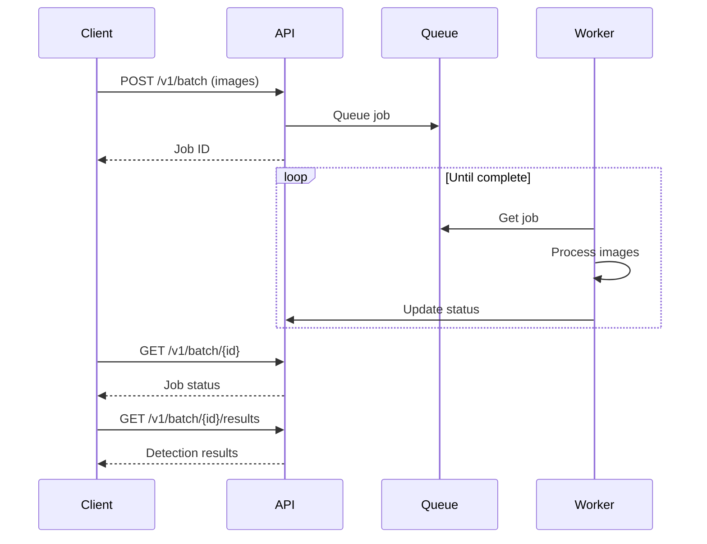

## Overview

Batch processing allows you to submit multiple images for asynchronous detection. This is ideal for:

- Processing large image libraries
- Bulk content moderation
- Background scanning workflows
- High-volume applications

## How It Works



## Submitting a Batch

Submit up to 100 images per batch:

<CodeGroup>

```python Python
from veri import VeriClient

client = VeriClient(api_key="your-api-key")

# Collect images
images = []
for path in image_paths:
    with open(path, "rb") as f:
        images.append(f.read())

# Submit batch
job = client.detect_batch(images)
print(f"Job submitted: {job.job_id}")
print(f"Status: {job.status}")
print(f"Images: {job.total_images}")
```

```typescript TypeScript
import { VeriClient } from '@veri/sdk';

const client = new VeriClient({ apiKey: 'your-api-key' });

// Collect images
const images = await Promise.all(
  imagePaths.map(path => fs.promises.readFile(path))
);

// Submit batch
const job = await client.detectBatch(images);
console.log(`Job submitted: ${job.jobId}`);
console.log(`Status: ${job.status}`);
console.log(`Images: ${job.totalImages}`);
```

</CodeGroup>

## Checking Status

Poll the job status to track progress:

<CodeGroup>

```python Python
import time

while True:
    status = client.get_batch_status(job.job_id)
    print(f"Progress: {status.processed_images}/{status.total_images}")

    if status.status == "completed":
        print("Job complete!")
        break
    elif status.status == "failed":
        print(f"Job failed: {status.error}")
        break

    time.sleep(2)  # Poll every 2 seconds
```

```typescript TypeScript
while (true) {
  const status = await client.getBatchStatus(job.jobId);
  console.log(`Progress: ${status.processedImages}/${status.totalImages}`);

  if (status.status === 'completed') {
    console.log('Job complete!');
    break;
  } else if (status.status === 'failed') {
    console.log(`Job failed: ${status.error}`);
    break;
  }

  await new Promise(r => setTimeout(r, 2000)); // Poll every 2 seconds
}
```

</CodeGroup>

## Getting Results

Retrieve results after the job completes:

<CodeGroup>

```python Python
results = client.get_batch_results(job.job_id)

for index, detection in results.results.items():
    print(f"Image {index}:")
    print(f"  Is fake: {detection['is_fake']}")
    print(f"  Confidence: {detection['confidence']:.1%}")
```

```typescript TypeScript
const results = await client.getBatchResults(job.jobId);

for (const [index, detection] of Object.entries(results.results)) {
  console.log(`Image ${index}:`);
  console.log(`  Is fake: ${detection.isFake}`);
  console.log(`  Confidence: ${(detection.confidence * 100).toFixed(1)}%`);
}
```

</CodeGroup>

## Convenience: Wait for Completion

The Python SDK provides a helper that polls until completion:

```python
# Submit and wait in one call
job = client.detect_batch(images)
results = client.wait_for_batch(
    job.job_id,
    poll_interval=2.0,  # Check every 2 seconds
    max_wait=300.0,     # Timeout after 5 minutes
)
```

## Batch Limits

| Limit | Value |
|-------|-------|
| Max images per batch | 100 |
| Max image size | 10 MB |
| Job retention | 24 hours |
| Max concurrent jobs | 10 (Pro), 50 (Enterprise) |

## Error Handling

Batch jobs can partially succeed. Check the status for details:

```python
status = client.get_batch_status(job.job_id)

print(f"Total: {status.total_images}")
print(f"Success: {status.success_count}")
print(f"Failed: {status.failure_count}")

if status.failure_count > 0:
    # Some images failed - results will contain error info
    results = client.get_batch_results(job.job_id)
    for index, result in results.results.items():
        if "error" in result:
            print(f"Image {index} failed: {result['error']}")
```

## Best Practices

1. **Batch similar images** - Group images by type for consistent results
2. **Monitor progress** - Use webhooks or polling for long-running jobs
3. **Handle failures gracefully** - Some images may fail; process successes separately
4. **Respect rate limits** - Don't submit too many concurrent batches
