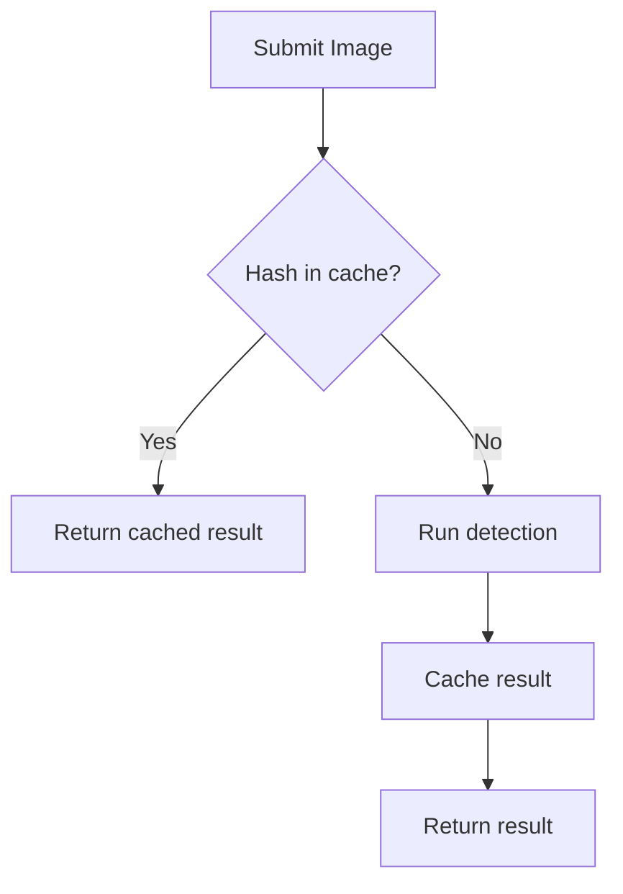

## Overview

Veri automatically caches detection results to improve performance and reduce costs. When you submit an image that has been analyzed before, you'll receive the cached result instantly.

## How It Works

1. When you submit an image, Veri computes a SHA-256 hash of the image data
2. If a result exists for that hash, it's returned immediately
3. If not, the image is processed and the result is cached



## Identifying Cached Results

Check the `cached` field in the response:

```python
result = client.detect(image)

if result.cached:
    print("Result from cache")
    print(f"Original detection: {result.timestamp}")
else:
    print("Fresh detection")
```

## Cache Duration

Results are cached for **24 hours** by default. After this period, the same image will be re-analyzed.

## Bypassing the Cache

To force a fresh detection, use the `skip_cache` option:

<CodeGroup>

```python Python
from veri import DetectionOptions

result = client.detect(
    image,
    options=DetectionOptions(skip_cache=True)
)
# Result will always be fresh, but still gets cached
```

```typescript TypeScript
const result = await client.detect(image, {
  skipCache: true
});
// Result will always be fresh, but still gets cached
```

</CodeGroup>

<Warning>
Bypassing the cache consumes a credit even if the image was previously analyzed. Use this option sparingly.
</Warning>

## When to Bypass Cache

Consider skipping the cache when:

- You need the latest model results after an update
- Testing or debugging detection accuracy
- The image may have been modified since last check
- You want to verify a previous result

## Cache and Credits

| Scenario | Credit Used |
|----------|-------------|
| Fresh detection | Yes |
| Cached result | No |
| `skip_cache: true` | Yes |
| Batch processing | Per unique image |

## Image Hashing

The cache key is based on the raw image bytes. This means:

- **Same image, different format** → Different hash → Both cached separately
- **Resized image** → Different hash → Cached separately
- **Identical bytes** → Same hash → Uses cache

```python
# These are cached separately (different bytes)
result1 = client.detect(image_as_jpeg)
result2 = client.detect(image_as_png)

# These use the same cache entry (same bytes)
result3 = client.detect(image_as_jpeg)  # Cached!
```

## Best Practices

1. **Use original images** - Don't re-encode before sending to maximize cache hits
2. **Store the image hash** - Use `result.image_hash` to track what you've analyzed
3. **Batch unique images** - In batch jobs, duplicate images are only processed once
4. **Monitor cache hits** - Track the `cached` field to understand your cache efficiency
