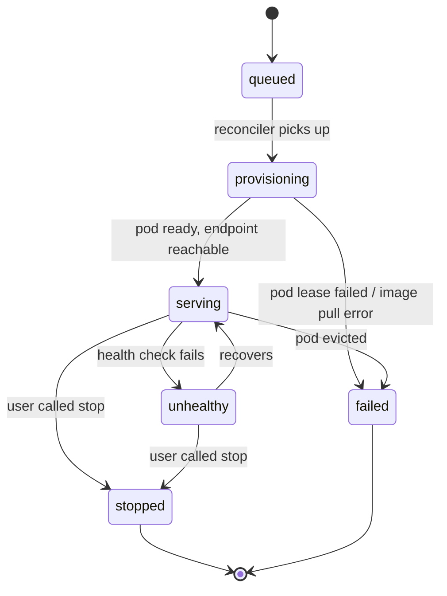

A deployment is a model running on a GPU you control, exposed at an HTTPS endpoint that speaks the OpenAI Chat Completions API. Point any tool that already speaks OpenAI at it — no client changes — and it works.

The smallest viable example is in the [Quickstart](/quickstart/deploy). This page is the mental model and the surface map.

## Two sources

| `source` | What you pass as `model` | When to use |
| --- | --- | --- |
| `huggingface` | Any HF model name (`Qwen/Qwen2.5-0.5B-Instruct`) | Serving an off-the-shelf model |
| `training_job` | A completed training job ID | Serving your own fine-tune |

## The deployment lifecycle



Cost accrues **only while `serving` or `unhealthy`**. No charge during `queued` or `provisioning`. Once `stopped`, cost stops; the deployment row stays for history (`total_cost_usd`, `total_requests`).

There is **no idle auto-stop today**. If you forget to call `stop`, the deployment keeps billing. We surface the live cost on the deployment in the dashboard, but the safest pattern is `stop` as soon as you're done.

## Calling a deployment

Once a deployment is `serving`, it accepts OpenAI-shaped requests at `dep.endpoint_url`. Three equivalent ways to call:

<CodeGroup>
```python Veri SDK
response = dep.chat([
    {"role": "user", "content": "Hello"},
])
```

```python OpenAI SDK
from openai import OpenAI
oai = OpenAI(base_url=dep.endpoint_url, api_key="vk_your_key_here")
response = oai.chat.completions.create(
    model=dep.name,
    messages=[{"role": "user", "content": "Hello"}],
)
```

```bash curl
curl "$ENDPOINT_URL/chat/completions" \
  -H "Authorization: Bearer vk_your_key_here" \
  -H "Content-Type: application/json" \
  -d '{
    "model": "your-deployment-name",
    "messages": [{"role": "user", "content": "Hello"}]
  }'
```
</CodeGroup>

Anything that already talks OpenAI works without changes — just swap `base_url`.

<Warning>
  Today's chat surface supports basic completions only. **Not yet supported:** streaming (`stream=true` is accepted but ignored — you always get the full response), `tool_calls` / `tools`, `top_p`, `frequency_penalty`, `presence_penalty`, structured outputs, and vision. Tools / streaming are on the roadmap.
</Warning>

## Sizing the GPU

Pick a GPU large enough to hold the weights with headroom. Some rough starting points:

| Model size | Minimum | Comfortable |
| --- | --- | --- |
| ≤ 1B | A100-80GB ×1 | A100-80GB ×1 |
| 3–8B | A100-80GB ×1 | H100 ×1 |
| 14–34B | H100 ×2 | H100 ×4 |
| 70B+ | H100 ×4 (quantized) | H100 ×8 |

Serving usually needs **less** GPU than training the same model. A 7B you trained on 8×A100 typically serves on 1×A100.

## Observability

Every deployment carries running counters:

```python
dep_metrics = client.deployments.metrics(dep.id)
# requests_total, tokens_in, tokens_out, latency_p50_ms, latency_p99_ms

recent = client.deployments.requests(dep.id, limit=50)
# last N requests with prompt + completion previews + latency
```

Or via CLI:

```bash
veri deployments metrics <id>
veri deployments requests <id> --limit 50 --format jsonl
```

## Cost

Cost is `gpu_rate × hours_serving × gpu_count × markup`. Same formula as training. Estimate before:

```bash
veri cost estimate --gpu-type A100-80GB --gpu-count 1 --hours 1
```

## Where to go next

<CardGroup cols={2}>
  <Card title="Quickstart: deploy a model" icon="rocket" href="/quickstart/deploy">
    Spin up + chat + stop in ~10 minutes.
  </Card>
  <Card title="Fine-tune your own model" icon="brain" href="/fine-tuning">
    Then deploy it from a `training_job` source.
  </Card>
  <Card title="Evaluate your deployment" icon="chart-line" href="/evaluations">
    Score it on a held-out dataset.
  </Card>
  <Card title="CLI deployment commands" icon="terminal" href="/cli/deployments">
    `veri deployments create / chat / stop`.
  </Card>
</CardGroup>
