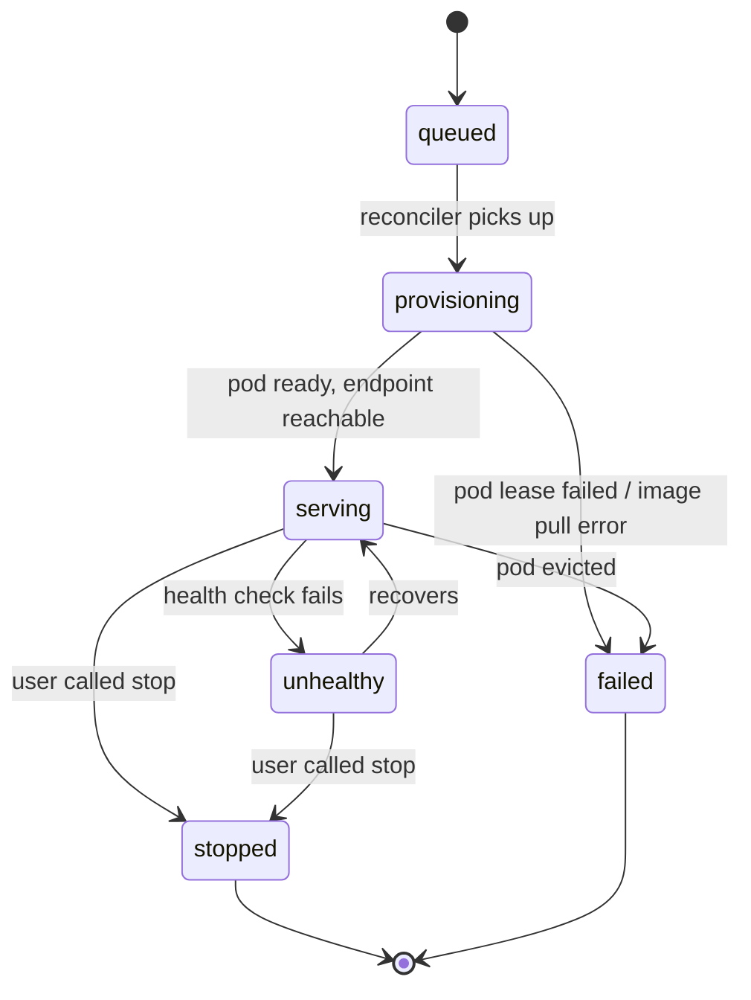

A deployment is a model running on a GPU you control, exposed at an HTTPS endpoint that speaks the OpenAI Chat Completions API. 

The smallest viable example is in the [Deploy a HF model quickstart](/demos/deploy-hf-quickstart). This page is the mental model and the surface map.

## Two sources

| `source` | What you pass as `model` | When to use |
| --- | --- | --- |
| `huggingface` | Any HF model name (`Qwen/Qwen2.5-0.5B-Instruct`) | Serving an off-the-shelf model |
| `training_job` | A completed training job ID | Serving your own trained model |

To name, store, and reuse your own weights (trained checkpoints, Hugging Face imports, or direct uploads), see [Custom models](/deployments/custom-models).

## Deployment parameters

You set these at create time, whether from the SDK (`client.deployments.create(...)`), the CLI (`veri deployments create`), or a `kind = "deploy"` config.

| Parameter | Required | Default | What it does |
| --- | --- | --- | --- |
| `model` | Yes | — | What to serve: a Hugging Face repo id, a completed training job id, or a [custom model](/deployments/custom-models) id, paired with `source`. |
| `source` | No | `training_job` | Where `model` comes from: `huggingface`, `training_job`, or `s3_model`. See [Two sources](#two-sources). |
| `name` | Yes | — | Display name, also the `model` value clients send in requests. |
| `gpu.gpu_type` | Yes | — | GPU SKU (for example `L4-24GB`, `A100-80GB`). Run `veri gpu list` for offered shapes and [Sizing the GPU](#sizing-the-gpu) for guidance. |
| `gpu.gpu_count` | No | `1` | GPUs per replica, for multi-GPU model parallelism. |
| `engine` | No | `vllm` | Inference engine: `vllm` or `max` (Modular MAX). |
| `provider` | No | auto | Cloud to serve on. Omit to let Veri choose. |
| `replicas` | No | `1` | Number of GPU-box replicas behind one endpoint (1-8). Experimental, see the note below. |

At call time, `chat` also accepts a session key for cache-warm routing across replicas.

| Parameter | Where | What it does |
| --- | --- | --- |
| `session_id` | `X-Veri-Session-Id` header, or the OpenAI `user` field | Pins a conversation to one replica so its KV cache stays warm across turns. Only affects multi-replica deployments. Experimental. |

<Warning>
  `replicas` and session affinity are a work in progress. The router and failover are shipped but lightly tested, and autoscaling (changing the replica count with load) is not implemented yet, so expect bugs. See [Multiple replicas and session affinity](/cli/deployments#multiple-replicas-and-session-affinity).
</Warning>

## The deployment lifecycle



Deployments consume GPU credit **only while `serving` or `unhealthy`**. No charge during `queued` or `provisioning`. Once `stopped`, billing stops; the deployment row stays for history.

<Warning>
  There is **no idle auto-stop today**. If you forget to call `stop`, the deployment keeps billing, so the safest pattern is `stop` as soon as you're done.
</Warning>

## Calling a deployment

Once a deployment is `serving`, it accepts OpenAI-shaped requests at `https://api.veri.studio/v1/deployments/{dep.id}/chat/completions`. Three equivalent ways to call:

<CodeGroup>
```python Veri SDK
from veri_sdk import Client

client = Client()
dep = client.deployments.get("dep_...")  # the object returned by client.deployments.create(...)

# dep carries its own id, so it routes to the right deployment.
response = dep.chat([
    {"role": "user", "content": "Hello"},
])
```

```python OpenAI SDK
from openai import OpenAI
oai = OpenAI(
    base_url=f"https://api.veri.studio/v1/deployments/{dep.id}",
    api_key="vk_your_api_key",
)
response = oai.chat.completions.create(
    model=dep.name,
    messages=[{"role": "user", "content": "Hello"}],
)
```

```bash curl
curl https://api.veri.studio/v1/deployments/$DEPLOYMENT_ID/chat/completions \
  -H "Authorization: Bearer vk_your_api_key" \
  -H "Content-Type: application/json" \
  -d '{
    "model": "your-deployment-name",
    "messages": [{"role": "user", "content": "Hello"}]
  }'
```
</CodeGroup>

Anything that already talks OpenAI works without changes — point `base_url` at `https://api.veri.studio/v1/deployments/{id}` (the OpenAI SDK appends `/chat/completions` for you).

<Warning>
  Today's chat surface supports basic completions only. **Not yet supported:** streaming (`stream=true` is accepted but ignored — you always get the full response), `tool_calls` / `tools`, `top_p`, `frequency_penalty`, `presence_penalty`, structured outputs, and vision. Tools / streaming are on the roadmap.
</Warning>

## Sizing the GPU

Pick a GPU large enough to hold the weights with headroom. Some rough starting points:

| Model size | Minimum | Comfortable |
| --- | --- | --- |
| ≤ 1B | A100-80GB ×1 | A100-80GB ×1 |
| 3–8B | A100-80GB ×1 | H100-80GB ×1 |
| 14–34B | H100-80GB ×2 | H100-80GB ×4 |
| 70B+ | H100-80GB ×4 (quantized) | H100-80GB ×8 |

Serving usually needs **less** GPU than training the same model. A 7B you trained on 8×A100 typically serves on 1×A100.

## Observability

Every deployment carries running counters:

```python
dep_metrics = client.deployments.metrics(dep.id)
# total_requests, total_prompt_tokens, total_completion_tokens, avg_latency_ms, error_rate, uptime_seconds

recent = client.deployments.requests(dep.id, limit=50)
# last N requests with prompt + completion previews + latency
```

Or via CLI:

```bash
veri deployments metrics <id>
veri deployments requests <id> --limit 50 --format jsonl
```

## Billing

Running deployments consume GPU credit until you stop them.

## Where to go next

<CardGroup cols={2}>
  <Card title="Quickstart: deploy a model" icon="rocket" href="/demos/deploy-hf-quickstart">
    Spin up + chat + stop in ~10 minutes.
  </Card>
  <Card title="Train your own model" icon="brain" href="/training">
    Then deploy it from a `training_job` source.
  </Card>
  <Card title="Evaluate your deployment" icon="chart-line" href="/evaluations">
    Score it on a held-out dataset.
  </Card>
  <Card title="CLI deployment commands" icon="terminal" href="/cli/deployments">
    `veri deployments create / chat / stop`.
  </Card>
</CardGroup>
