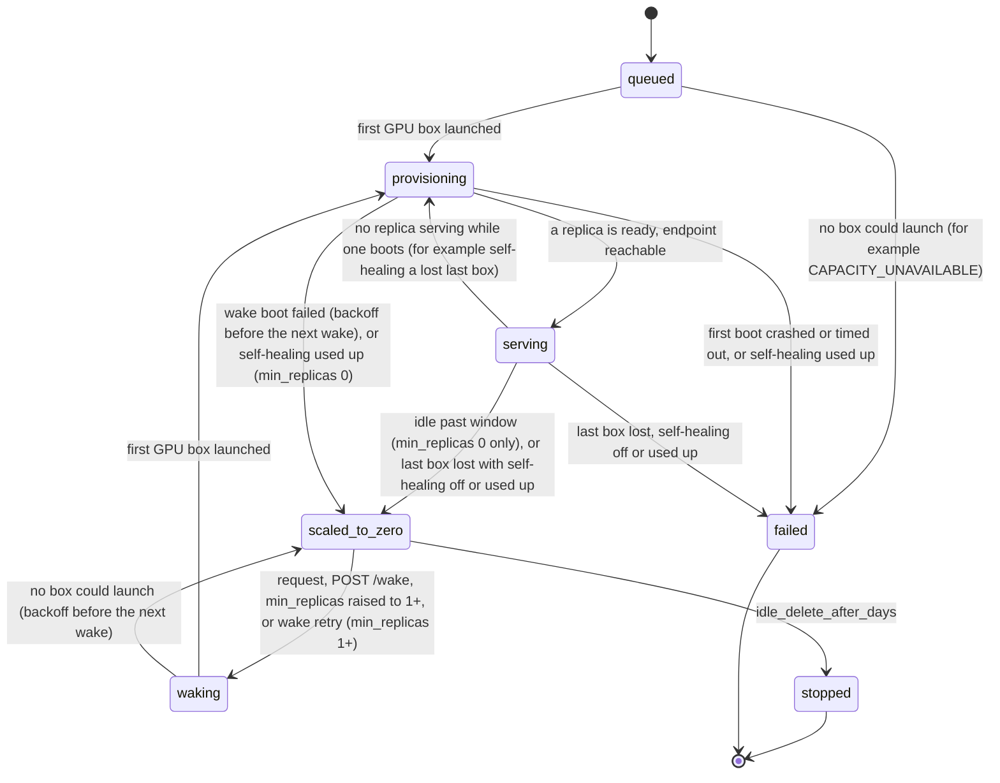

A deployment is a model running on a GPU you control, exposed at an HTTPS endpoint that speaks the OpenAI Chat Completions API. 

<Warning>
  Deployments are in early access. GPU capacity for serving is limited, so creates can hit capacity errors and larger shapes may not be orderable — check [`veri gpu list`](/cli/reference#gpu) for what's live before planning around a specific GPU. Training is fully supported and is the platform's primary focus today.
</Warning>

The smallest viable example is in the [Deploy a HF model quickstart](/demos/deploy-hf-quickstart). This page is the mental model and the surface map.

## Model sources

| `source` | What you pass as `model` | When to use |
| --- | --- | --- |
| `huggingface` | Any HF model name (`Qwen/Qwen2.5-0.5B-Instruct`) | Serving an off-the-shelf model |
| `training_job` | A completed training job ID | Serving your own trained model |
| `custom_model` | A saved model ID | Serving a model from your [library](/deployments/custom-models) |

To name, store, and reuse a trained checkpoint as a deployable model, see [Custom models](/deployments/custom-models).

A `huggingface` deployment can also [cache the model in your library](/deployments/custom-models#cache-a-hugging-face-model-while-deploying-it) (`cache: true`), and it automatically serves from a cached copy when you have one — faster starts, no hub download.

## Deployment parameters

You set these at create time, whether from the [SDK](/deployments/examples) (`client.deployments.create(...)`), the [CLI](/cli/deployments#create-from-a-config) (`veri deployments create`), or a [`kind = "deploy"` config](/cli/run#configs-deploy-toml).

| Parameter | Required | Default | What it does |
| --- | --- | --- | --- |
| `model` | Yes | — | What to serve: a Hugging Face repo id, a completed training job id, or a [custom model](/deployments/custom-models) id, paired with `source`. |
| `source` | No | `training_job` | Where `model` comes from: `huggingface`, `training_job`, or `custom_model`. See [Model sources](#model-sources). |
| `name` | Yes | — | Display name, also the `model` value clients send in requests. |
| `gpu.gpu_type` | Yes | — | GPU SKU (for example `L4-24GB`, `A100-80GB`). Run `veri gpu list` for offered shapes and [Sizing the GPU](#sizing-the-gpu) for guidance. |
| `gpu.gpu_count` | Yes (inline CLI flags default to `1`) | none | GPUs per replica, for multi-GPU model parallelism. Must be a count the provider sells for that `gpu_type`: on AWS, `1` or `4` for `L4-24GB`/`A10G-24GB` and `8` for `A100-80GB`/`H100-80GB`. |
| `engine` | No | `vllm` | Inference engine. `vllm` is the only serving engine; any other value returns a 400 at create. |
| `provider` | No | `aws` | Cloud to serve on — see [Serving providers](/deployments/providers) for shapes and status, or run `veri gpu list` for the live catalog. |
| `replicas` | No | `1` | GPU-box replicas behind one endpoint (1-8). Shorthand for equal `min_replicas`/`max_replicas` (a fixed fleet). |
| `min_replicas` | No | `replicas` | Lower replica bound. Set below `max_replicas` to enable autoscaling; set to `0` to enable scale to zero. |
| `max_replicas` | No | `replicas` | Upper replica bound (1-8). |
| `concurrency_target` | No | `8` | In-flight requests per replica the autoscaler aims for. Lower it for latency-sensitive traffic, raise it for batch throughput. |
| `scale_to_zero_window_seconds` | No | `3600` | Idle seconds before a `min_replicas: 0` deployment parks, counted from when the deployment starts serving or from its last request (not from create or wake). Turning scale-to-zero on, or changing the window, starts a fresh idle window. Minimum `300`. |
| `idle_delete_after_days` | No | off | Auto-stop a deployment that has been parked at zero with no traffic for this many days. |
| `self_heal_attempts` | No | `3` | How many times Veri replaces the GPU box when the deployment's last box dies after it has served (crash or host failure), `0` to `5`. See [Self-healing](#self-healing). |
| `cache` | No | `false` | `source: huggingface` only: also [save the model to your library](/deployments/custom-models#cache-a-hugging-face-model-while-deploying-it) for faster future starts. Best-effort; never affects this deployment. |
| `vllm_image` | No | platform vLLM | Explicit vLLM serving image (e.g. `vllm/vllm-openai:v0.25.1`) for architectures newer than the platform's vLLM. See [Serving newer architectures](#serving-newer-architectures). |
| `trace_bodies` | No | `false` | Capture this deployment's request/response bodies as browsable [traces](/deployments/observability#request-traces). Enabling stores end-user prompt/completion content. First 5,000 traces per workspace each month are free, then metered per 1k from credits. |
| `trace_retention` | No | `base` | Trace retention class: `base` (14 days) or `extended` (400 days, extended rate). Requires `trace_bodies: true`. |

`min_replicas`, `max_replicas`, `concurrency_target`, `scale_to_zero_window_seconds`, `idle_delete_after_days`, and `self_heal_attempts` can also be changed later on a live deployment: see [Scaling](/cli/deployments#replicas-autoscaling-and-scale-to-zero). Model, GPU, and provider are immutable: changing those means a new deployment. Send `null` for `scale_to_zero_window_seconds` or `idle_delete_after_days` to put it back to its default. Raising `min_replicas` to 1 or more on a parked (`scaled_to_zero`) deployment wakes it immediately, subject to the workspace active-replica limit (`429` if it is full, and nothing changes). Scaling changes made during the first boot apply once the deployment is serving; a new `self_heal_attempts` applies immediately in every status. See [what an update does in each status](/deployments/api#patch-v1deploymentsid).

At call time, `chat` also accepts a session key for cache-warm routing across replicas.

| Parameter | Where | What it does |
| --- | --- | --- |
| `session_id` | `X-Veri-Session-Id` header, or the OpenAI `user` field | Pins a conversation to one replica so its KV cache stays warm across turns. Only affects multi-replica deployments. |

## The deployment lifecycle


```mermaid
stateDiagram-v2
    [*] --> queued
    queued --> provisioning : first GPU box launched
    queued --> failed : no box could launch (for example CAPACITY_UNAVAILABLE)
    provisioning --> serving : a replica is ready, endpoint reachable
    provisioning --> failed : first boot crashed or timed out, or self-healing used up
    serving --> provisioning : no replica serving while one boots (for example self-healing a lost last box)
    serving --> failed : last box lost, self-healing off or used up
    serving --> scaled_to_zero : idle past window (min_replicas 0 only), or last box lost with self-healing off or used up
    provisioning --> scaled_to_zero : wake boot failed (backoff before the next wake), or self-healing used up (min_replicas 0)
    scaled_to_zero --> waking : request, POST /wake, min_replicas raised to 1+, or wake retry (min_replicas 1+)
    waking --> provisioning : first GPU box launched
    waking --> scaled_to_zero : no box could launch (backoff before the next wake)
    scaled_to_zero --> stopped : idle_delete_after_days
    stopped --> [*]
    failed --> [*]
```

Not drawn: `stop` moves a deployment in any status other than `stopped` or `failed` to `stopped`. Running out of credit, or the workspace losing its last member, moves a `queued`, `provisioning`, `serving`, or `waking` deployment to `failed`. `stopped` and `failed` are final.

Deployments consume GPU credit **only while replicas are running**: billing is metered per replica, from each GPU box's launch (warmup included) to its termination. `scaled_to_zero` charges nothing. Once `stopped`, billing stops; the deployment row stays for history. `stop` is permanent, not a pause: a stopped deployment cannot be woken or resumed (bring it back by creating a new one). Scale to zero (`min_replicas: 0`) is the pause path.

<Warning>
  A deployment with `min_replicas` of 1 or more (the default) **never stops billing on its own** — you asked for an always-warm floor. Either call `stop` when you're done, or create with `min_replicas: 0` so it parks itself after the idle window and wakes on the next request.
</Warning>

## Self-healing

When a deployment that has served loses its last GPU box (the box crashes, its host fails, or it stops reporting for about 3 minutes), Veri replaces the box automatically. `self_heal_attempts` (`0` to `5`, default `3`) caps how many replacements Veri launches for one loss:

- While a replacement boots, the deployment shows `provisioning` with `failure_code: replica_lost` and an `error` such as `Replacing a lost GPU box (attempt 1 of 3).` Chat requests get a `503` with `Retry-After` until it serves again. Each replacement box is billed from its launch, like any replica.
- Replacements follow a fixed ladder: the first goes out at once, the next ones 10, 20, 40 and 80 seconds after the previous launch. A replacement that crashes, that does not become healthy within the boot deadline, or that the cloud rejects counts as one attempt.
- When a replacement reaches `serving`, `failure_code` and `error` clear and the full budget is available again for the next loss. Any PATCH to the deployment also restarts the budget.
- When the attempts are used up, or with `self_heal_attempts: 0`, a deployment with `min_replicas` of 1 or more goes `failed` with `failure_code: replica_lost` (billing ends; redeploy to bring it back), and a `min_replicas: 0` deployment parks (`scaled_to_zero`, also with `replica_lost`) and wakes on the next request.

`self_heal_attempts` only governs losing the last box. A multi-replica fleet that loses some of its boxes keeps serving on the rest and replaces them on the same ladder whatever the setting, pausing after 5 replacements until you PATCH the deployment. A first boot that fails is not self-healed (it fails with `watchdog_timeout` or the box's own `failure_code`), and a wake that fails re-parks with backoff instead (with `min_replicas` of 1 or more, Veri retries that wake itself once the backoff has passed, and stops after 3 failed wakes in a row).

## Calling a deployment

Once a deployment is `serving`, it accepts OpenAI-shaped requests at `https://api.veri.studio/v1/deployments/{dep.id}/chat/completions`. Three equivalent ways to call:

<CodeGroup>
```python Veri SDK
from veri_sdk import Client

client = Client()
dep = client.deployments.get("dep_...")  # the object returned by client.deployments.create(...)

# dep carries its own id, so it routes to the right deployment.
response = dep.chat([
    {"role": "user", "content": "Hello"},
])
```

```python OpenAI SDK
from openai import OpenAI
oai = OpenAI(
    base_url=f"https://api.veri.studio/v1/deployments/{dep.id}",
    api_key="vk_your_api_key",
)
response = oai.chat.completions.create(
    model=dep.name,
    messages=[{"role": "user", "content": "Hello"}],
)
```

```bash curl
curl https://api.veri.studio/v1/deployments/$DEPLOYMENT_ID/chat/completions \
  -H "Authorization: Bearer vk_your_api_key" \
  -H "Content-Type: application/json" \
  -d '{
    "model": "your-deployment-name",
    "messages": [{"role": "user", "content": "Hello"}]
  }'
```
</CodeGroup>

Anything that already talks OpenAI works without changes — point `base_url` at `https://api.veri.studio/v1/deployments/{id}` (the OpenAI SDK appends `/chat/completions` for you).

<Note>
  The chat surface is a passthrough to vLLM: streaming (`stream=true`, real SSE) works, and request parameters beyond `temperature` / `max_tokens` (`top_p`, `stop`, `seed`, `response_format`, `tools`, ...) are forwarded to the engine untouched — vLLM is the schema authority. See [OpenAI compatibility](/deployments/openai-compat) for details and caveats (tool calling needs vLLM tool parsing enabled via `vllm_extra_args`).
</Note>

## Sizing the GPU

Pick a GPU large enough to hold the weights with headroom. Some rough starting points:

| Model size | Minimum | Comfortable |
| --- | --- | --- |
| ≤ 4B | L4-24GB ×1 | L4-24GB ×1 |
| 7–8B | L4-24GB ×1 (shorter context) | L4-24GB ×4 |
| 14–34B | L4-24GB ×4 | H100-80GB ×8 |
| 70B+ | A100-80GB ×8 | H100-80GB ×8 |

These are the shapes AWS (the default provider) sells: `L4-24GB` and `A10G-24GB` come as 1 or 4 GPUs, and `A100-80GB` and `H100-80GB` only as whole 8-GPU nodes. Other GPU counts are rejected at create with a `400`. See [Serving providers](/deployments/providers). On a single 24 GB card, a 7-8B model with a long context window may need a smaller context length to fit its KV cache: pass `vllm_extra_args: ["--max-model-len", "8192"]`, or use 4 GPUs.

Serving usually needs **less** GPU than training the same model. A 7B you trained on an 8×A100 node typically serves on 1 to 4 L4s.

## Serving newer architectures

Deployments run a platform-managed vLLM version by default. A model architecture released after that version fails to start (`vllm_failed_to_start`) because vLLM doesn't recognize it yet.

To serve one, pin the deployment to a newer official vLLM image:

```bash
veri deployments create \
  --from-hf poolside/Laguna-M.1 \
  --gpu-type A100-80GB --gpu-count 8 \
  --vllm-image vllm/vllm-openai:v0.25.1
```

Or in a deploy config:

```toml
[deployment]
vllm_image = "vllm/vllm-openai:v0.25.1"
```

How it behaves:

- Only official upstream images are accepted: `vllm/vllm-openai:<tag>` (NVIDIA) or `vllm/vllm-openai-rocm:<tag>` (AMD). Anything else is rejected at create.
- The image runs via Docker on the deployment's box, on every provider, and is used exactly as written: the platform never rewrites or substitutes it.
- The image is pulled from Docker Hub when the box boots, so the boot deadline is longer than the default 20 minutes: 40 minutes plus 5 seconds per GB of the deployment's total GPU memory. The pull can still be too slow or rate limited to provision reliably: a first boot that passes the deadline fails with `watchdog_timeout`, and a wake boot re-parks (a request after the backoff, or `POST /wake`, wakes it again). Explicit images are supported as literal overrides; the supported route for a newer architecture is the platform's next validated vLLM version.
- Without `vllm_image`, the deployment runs the platform-managed vLLM version for its provider, which never pulls at boot.
- `engine: vllm` only.
- The image is set at create and immutable, like model and GPU.

Check the [vLLM release notes](https://docs.vllm.ai) for the minimum version your architecture needs.

<Note>
  A `vllm_image` deployment keeps its Hugging Face download inside the serving container, so it can't be combined with `cache: true` model-library uploads — the cache upload is skipped.
</Note>

## Observability

Every deployment records request, token, latency, error, cost, and engine-health telemetry. The [Deployment observability guide](/deployments/observability) includes an end-to-end smoke test plus dashboard, SDK, REST, and MCP workflows.

Lifetime counters and recent requests are available directly from the SDK:

```python
dep_metrics = client.deployments.metrics(dep.id)
# request and token totals, latency percentiles, error rate, cost, and uptime

recent = client.deployments.requests(dep.id, limit=50)
# terminal request timing, usage, status, errors, and cancellation state
```

Or via CLI:

```bash
veri deployments metrics <id>
veri deployments requests <id> --limit 50 --format jsonl
```

Deployments created with `trace_bodies: true` additionally capture full
request/response bodies as [traces](/deployments/observability#request-traces),
browsable from the dashboard, CLI, and API.

## Billing

Running deployments consume GPU credit until you stop them (or, with `min_replicas: 0`, until they park themselves). See [Billing](/deployments/cost) for states and cadence.

## Where to go next

<CardGroup cols={2}>
  <Card title="Quickstart: deploy a model" icon="rocket" href="/demos/deploy-hf-quickstart">
    Spin up + chat + stop in ~10 minutes.
  </Card>
  <Card title="Train your own model" icon="brain" href="/training">
    Then deploy it from a `training_job` source.
  </Card>
  <Card title="Monitor your deployment" icon="chart-line" href="/deployments/observability">
    Request metrics, GPU telemetry, and logs.
  </Card>
  <Card title="CLI deployment commands" icon="terminal" href="/cli/deployments">
    `veri deployments create / chat / stop`.
  </Card>
</CardGroup>
