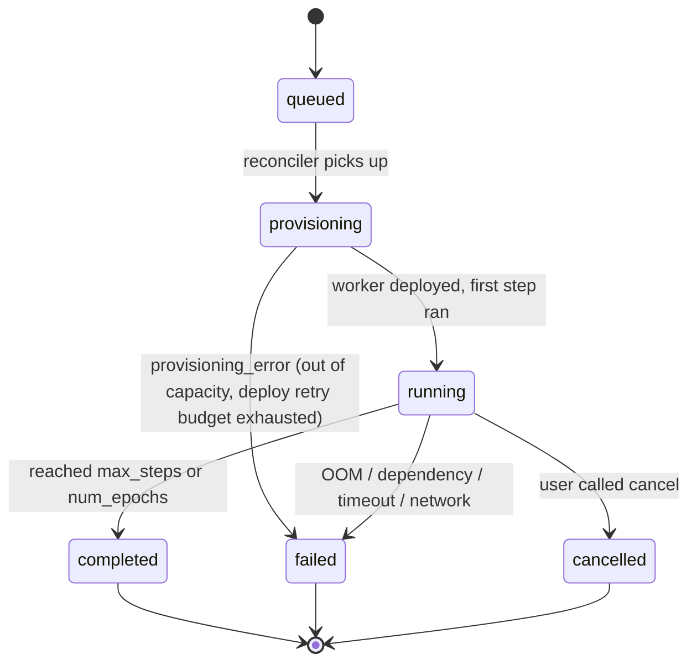

Fine-tuning on Veri is **dataset + reward function + base model → fine-tuned checkpoint**. You submit a training job; Veri provisions the GPU, runs the loop, streams metrics, and uploads the result. You either download the checkpoint or [deploy it](/deployments) directly.

The smallest viable example is in the [Quickstart](/quickstart/fine-tune). This page is the mental model and the surface map.

## Methods

| Method | What it trains | Reward function? | Backend |
| --- | --- | --- | --- |
| `grpo` | LLMs (Qwen, Llama, DeepSeek, …) | Required | TRL GRPOTrainer |
| `grpo_agentic` | LLMs with multi-turn agent traces (H100 only) | Forbidden — uses OpenReward environments instead | TRL + OpenReward |
| `sft_video_gen` | Video-gen models (CogVideoX, Wan2.1, LTX, Mochi) | Forbidden — uses the dataset's video pairs directly | diffusers + LoRA via accelerate |

GRPO is the default. SFT for text and DPO are on the roadmap.

## The training loop



What happens at each transition:

- **`queued`** — job row written, balance pre-checked (HTTP 402 if insufficient credit). No spend yet.
- **`provisioning`** — Veri calls the compute provider, leases a GPU, deploys the worker agent over SSH. `started_at` is still `null`.
- **`running`** — worker reports its first step. `started_at` populates. Metrics start streaming. Cost accrues.
- **`completed | failed | cancelled`** — pod auto-terminates. Cost is attributed (`cost_attributed_at`). Stripe credit is deducted (`billing_deducted_at`). The full stdout is uploaded to S3 and accessible via `client.training_jobs.get(id).logs_url` (or `GET /v1/training_jobs/{id}/logs/full`).

Cancellation is **cooperative**: the worker terminates at the next checkpoint boundary, not instantly.

## Failure modes

When a job ends in `failed`, `error.code` carries one of:

| `error.code` | Common cause | What to do |
| --- | --- | --- |
| `oom` | Model too large for the chosen GPU | Drop to a smaller base, raise `gpu_count`, or shrink `max_response_length` |
| `provisioning_error` | SSH deploy failed, retry budget exhausted (5 attempts), provider out of capacity | Re-submit; if persistent, switch provider |
| `training_error` | Worker crash, reward function error, dataset loading error — generic catch-all | Read `error.message` + the full log via `GET /v1/training_jobs/{id}/logs/full` |
| `worker_heartbeat_timeout` | Worker stopped reporting status for >15 minutes (likely OOM-killed or SSH dropped) | Re-submit; if persistent, raise `gpu_count` |

The last 200 log lines from the worker are surfaced in `error.log_tail` for fast triage; the full stdout is uploaded to S3 and accessible via `GET /v1/training_jobs/{id}/logs/full`.

## Submitting a job

```python
from veri_sdk import Client
client = Client()

job = client.training_jobs.create(
    base_model="Qwen/Qwen2.5-0.5B-Instruct",
    dataset_id=dataset.id,
    reward_function_id=reward_fn.id,
    output_name="qwen-0.5b-math",
    method="grpo",
    hyperparameters={
        "learning_rate": 1e-6,
        "rollouts_per_prompt": 4,
        "max_response_length": 512,
        "kl_coef": 0.001,
        "max_steps": 50,
    },
    gpu_type="A100-80GB",
    gpu_count=1,
)

job.wait(poll_interval=15)
job.download(output_dir="./checkpoints")
```

Same shape from the CLI:

```bash
veri run configs/grpo.toml
```

with `kind = "train"` in the TOML config. See the [CLI training reference](/cli/training) for the full schema.

## Cost

Cost is `gpu_rate × duration × gpu_count × markup`. Default markup is 1.3. You can preview before submission:

<CodeGroup>
```python SDK
client.cost.estimate(
    gpu_type="A100-80GB",
    gpu_count=1,
    duration_minutes=30,
)
```

```bash CLI
veri cost estimate --gpu-type A100-80GB --gpu-count 1 --hours 0.5
```
</CodeGroup>

The job-creation endpoint refuses with HTTP 402 if your credit balance is below the worst-case estimate.

## Where to go next

<CardGroup cols={2}>
  <Card title="Quickstart: fine-tune a model" icon="rocket" href="/quickstart/fine-tune">
    End-to-end on a small model in ~15 minutes.
  </Card>
  <Card title="Deploy your checkpoint" icon="cloud" href="/deployments">
    Skip downloading — serve from Veri with an OpenAI-compatible API.
  </Card>
  <Card title="Evaluate it" icon="chart-line" href="/evaluations">
    Score the fine-tune on a held-out dataset.
  </Card>
  <Card title="CLI training commands" icon="terminal" href="/cli/training">
    `veri run`, `veri jobs`, `veri rewards`.
  </Card>
</CardGroup>
