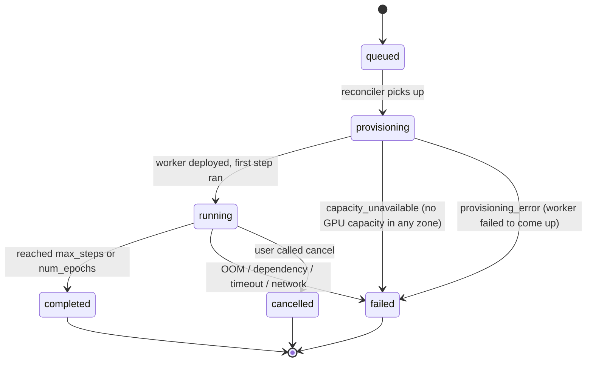

Managed training on Veri is **dataset + base model → trained checkpoint**. You submit a training job; Veri provisions the GPU, runs the loop, streams metrics, and uploads the result. You either download the checkpoint or [deploy it](/deployments) directly.

The training method you pick decides how outputs are scored. GRPO takes a [reward function](/training/reward-functions); SFT and DPO learn directly from examples or preference pairs. For the smallest end-to-end run, see the [Managed GRPO quickstart](/demos/managed-grpo-quickstart) — one decorated reward and one command.

## Methods

| Method | Summary | Backend |
| --- | --- | --- |
| `grpo` | Single-turn RL for LLMs: the model generates one completion and your reward function scores it. | [TRL GRPOTrainer](https://huggingface.co/docs/trl/grpo_trainer) (Unsloth-accelerated when enabled) |
| `grpo_agentic` | Multi-turn agentic RL for LLMs: the model acts in an environment across turns and reward comes from the environment outcome. **Not currently available** while the agentic engine is rebuilt. | Rebuilding |
| `sft_text` | Supervised finetuning for LLMs on text or chat data, learning directly from your labeled completions. | [TRL SFTTrainer](https://huggingface.co/docs/trl/sft_trainer) |
| `dpo` | Preference tuning for LLMs on chosen/rejected pairs, with no reward function. | [TRL DPOTrainer](https://huggingface.co/docs/trl/dpo_trainer) |
| `sft_video_gen` | LoRA finetuning for video-gen models (CogVideoX, Wan2.1, LTX, Mochi) from the dataset's video pairs. | [diffusers + LoRA](https://huggingface.co/docs/diffusers/main/en/training/lora) via accelerate |

GRPO is the default. All methods support [LoRA and QLoRA](/training/grpo#lora-and-qlora).

<Note>
  `grpo_agentic` is being rebuilt and is not currently runnable as a managed method. To run multi-turn, environment-based RL today, use a [custom script](/training/custom-script) with your own framework (for example verl) and environment.
</Note>

## The training loop



What happens at each transition:

- **`queued`** — job row written, balance pre-checked (HTTP 402 if insufficient credit). No spend yet.
- **`provisioning`** — Veri leases a GPU and the instance boots and self-configures the worker. `started_at` is still `null`. Once the instance boots, the GPU is rented and **cost accrues from this point**, even before the first training step. A job that never secures a GPU (for example `CAPACITY_UNAVAILABLE`) rents nothing and is not billed.
- **`running`** — worker reports its first step. `started_at` populates. Metrics start streaming.
- **`completed | failed | cancelled`** — pod auto-terminates. Cost is attributed (`cost_attributed_at`). Stripe credit is deducted (`billing_deducted_at`). The full stdout is uploaded to S3 and available via `GET /v1/training_jobs/{id}/logs/full`.

Cancellation is **cooperative**: the worker terminates at the next checkpoint boundary, not instantly.

## Failure modes

When a job ends in `failed`, `error.code` carries one of:

| `error.code` | Common cause | What to do |
| --- | --- | --- |
| `oom` | Model too large for the chosen GPU | Drop to a smaller base, raise `gpu_count`, or shrink `max_response_length` |
| `CAPACITY_UNAVAILABLE` | No GPU capacity for the requested type in any availability zone, after trying every capable zone (`max_launch_attempts`) | Retry later, pick a different `gpu_type`, or launch in another region (`veri regions list`, then `region="..."`). Capacity is provider-side and not pre-checkable |
| `provisioning_error` | The instance booted but the worker did not come up | Re-submit; if persistent, try a different `gpu_type` |
| `provisioning_timeout` | The instance never reached a running worker within the provisioning deadline | Re-submit; capacity or boot was too slow |
| `configuring_timeout` | The worker booted but made no training progress within the configuring deadline | Re-submit; if persistent, check the full log via `GET /v1/training_jobs/{id}/logs/full` |
| `heartbeat_timeout` | Worker stopped reporting status for longer than `heartbeat_timeout_seconds` (default 300s; likely OOM-killed or network dropped) | Re-submit; if persistent, raise `gpu_count` |
| `training_error` | Worker crash, reward function error, or dataset loading error (generic catch-all) | Read `error.message` + the full log via `GET /v1/training_jobs/{id}/logs/full` |

The last 200 log lines from the worker are surfaced in `error.log_tail` for fast triage; the full stdout is uploaded to S3 and accessible via `GET /v1/training_jobs/{id}/logs/full`.

## Submitting a job

```python
from veri_sdk import Client
client = Client()

job = client.training_jobs.create(
    base_model="Qwen/Qwen2.5-0.5B-Instruct",
    dataset_id=dataset.id,
    reward_function_id=reward_fn.id,
    output_name="qwen-0.5b-math",
    method="grpo",
    hyperparameters={
        "learning_rate": 1e-6,
        "rollouts_per_prompt": 4,
        "max_response_length": 512,
        "kl_coef": 0.001,
        "max_steps": 50,
    },
    gpu_type="L4-24GB",
    gpu_count=1,
)

job.wait(poll_interval=15)
job.download(output_dir="./checkpoints")
```

### Choosing a launch region

Capacity is per-region. If your job fails with `CAPACITY_UNAVAILABLE`, another region may have the GPU you need right now:

```bash
veri regions list        # offered regions; default marked, coming-soon flagged
veri gpu list            # live availability per provider and region
```

Pass `region="us-west-2"` to `client.training_jobs.create`, the `@veri.train` decorator, or `veri train --region us-west-2`. Omit it to launch in the default region. Unknown or not-yet-available regions are rejected at submit with the list of valid options.

<Note>
  This snippet uses the low-level client and assumes you have already uploaded a dataset and reward function (the `dataset` and `reward_fn` it references). For a runnable end-to-end version that handles those uploads for you with `@training_job` + `veri train`, see the [Managed GRPO quickstart](/demos/managed-grpo-quickstart).
</Note>

Same shape from the CLI:

```bash
veri run configs/grpo.toml
```

with `kind = "train"` in the TOML config. See the [CLI training reference](/cli/training) for the full schema.

## Where to go next

<CardGroup cols={2}>
  <Card title="Managed GRPO quickstart" icon="rocket" href="/demos/managed-grpo-quickstart">
    End-to-end on a small model: one decorator, one command.
  </Card>
  <Card title="Deploy your checkpoint" icon="cloud" href="/deployments">
    Skip downloading — serve from Veri with an OpenAI-compatible API.
  </Card>
  <Card title="Evaluate it" icon="chart-line" href="/evaluations">
    Score the trained model on a held-out dataset.
  </Card>
  <Card title="CLI training commands" icon="terminal" href="/cli/training">
    `veri run`, `veri jobs`, `veri rewards`.
  </Card>
</CardGroup>
