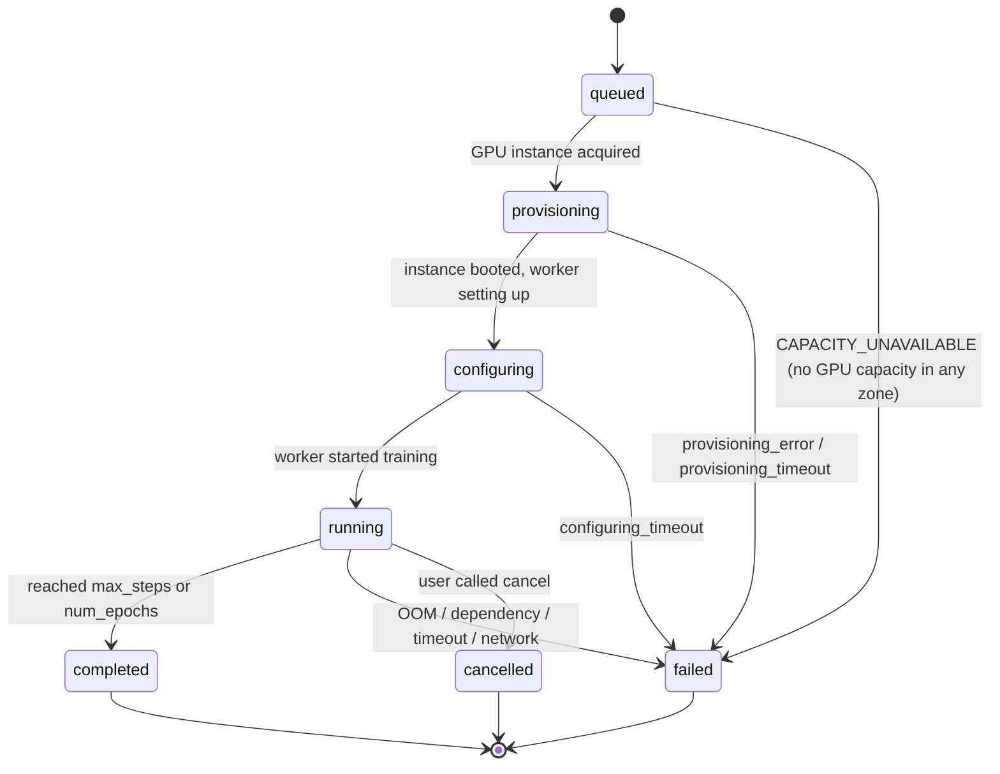

Managed training on Veri is **dataset + base model → trained checkpoint**. You submit a training job; Veri provisions the GPU, runs the loop, streams metrics, and uploads the result. You either download the checkpoint or [deploy it](/deployments) directly.

The training method you pick decides how outputs are scored. GRPO takes a [reward function](/training/reward-functions); SFT and DPO learn directly from examples or preference pairs. For the smallest end-to-end run, see the [Managed GRPO quickstart](/demos/managed-grpo-quickstart) — one decorated reward and one command.

## Methods

| Method | Summary | Backend |
| --- | --- | --- |
| `grpo` | Single-turn RL for LLMs: the model generates one completion and your reward function scores it. | [TRL GRPOTrainer](https://huggingface.co/docs/trl/grpo_trainer) (Unsloth-accelerated when enabled) |
| `grpo_agentic` | Multi-turn agentic RL for LLMs: the model acts in an environment across turns and reward comes from the environment outcome. **Not currently available** while the agentic engine is rebuilt. | Rebuilding |
| `sft_text` | Supervised finetuning for LLMs on text or chat data, learning directly from your labeled completions. | [TRL SFTTrainer](https://huggingface.co/docs/trl/sft_trainer) |
| `dpo` | Preference tuning for LLMs on chosen/rejected pairs, with no reward function. | [TRL DPOTrainer](https://huggingface.co/docs/trl/dpo_trainer) |

GRPO is the default. All methods support [LoRA and QLoRA](/training/grpo#lora-and-qlora).

<Note>
  `grpo_agentic` is being rebuilt and is not currently runnable as a managed method. To run multi-turn, environment-based RL today, use a [custom script](/training/custom-script) with your own framework (for example verl) and environment.
</Note>

## The training loop


```mermaid
stateDiagram-v2
    [*] --> queued
    queued --> provisioning : GPU instance acquired
    queued --> failed : CAPACITY_UNAVAILABLE (no GPU capacity in any zone)
    provisioning --> configuring : instance booted, worker setting up
    provisioning --> failed : provisioning_error / provisioning_timeout
    configuring --> running : worker started training
    configuring --> failed : configuring_timeout
    running --> completed : reached max_steps or num_epochs
    running --> failed : OOM / dependency / timeout / network
    running --> cancelled : user called cancel
    completed --> [*]
    failed --> [*]
    cancelled --> [*]
```

What happens at each transition:

- **`queued`**: job row written (HTTP 402 at submit if the workspace has no billing account). No spend yet. Veri tries to acquire a GPU instance from here; if no zone has capacity, the job goes straight to `failed` with `CAPACITY_UNAVAILABLE`.
- **`provisioning`**: Veri has leased a GPU and the instance boots. `started_at` is still `null`. Once the instance is acquired, the GPU is rented and **cost accrues from this point**, even before the first training step. A job that never secures a GPU (for example `CAPACITY_UNAVAILABLE`) rents nothing and is not billed.
- **`configuring`**: the instance is up and the worker is setting up its environment.
- **`running`**: the worker has started the training process (dataset and model load, then training steps). `started_at` populates. Metrics start streaming with the first step.
- **`completed | failed | cancelled`**: pod auto-terminates. Cost is attributed (`cost_attributed_at`). Stripe credit is deducted (`billing_deducted_at`). The full stdout is uploaded to S3 and available via `GET /v1/training_jobs/{id}/logs/full`.

Cancellation is **immediate**: the instance is terminated as soon as the request is
accepted. The worker does not get a chance to flush anything, and a job saves its
weights only at completion (see [Checkpoints](#checkpoints)), so a cancelled job leaves no trained weights.

## Failure modes

When a job ends in `failed`, `error.code` carries one of:

| `error.code` | Common cause | What to do |
| --- | --- | --- |
| `oom` | Model too large for the chosen GPU | Drop to a smaller base, raise `gpu_count`, or shrink `max_response_length` |
| `CAPACITY_UNAVAILABLE` | No GPU capacity for the requested type in any availability zone, after trying every capable zone (`max_launch_attempts`) | Retry later, pick a different `gpu_type`, or launch in another region (`veri regions list`, then `region="..."`). Capacity is provider-side and not pre-checkable |
| `provisioning_error` | The instance booted but the worker did not come up | Re-submit; if persistent, try a different `gpu_type` |
| `provisioning_timeout` | The instance never reached a running worker within the provisioning deadline | Re-submit; capacity or boot was too slow |
| `configuring_timeout` | The worker booted but made no training progress within the configuring deadline | Re-submit; if persistent, check the full log via `GET /v1/training_jobs/{id}/logs/full` |
| `heartbeat_timeout` | Worker stopped reporting status for longer than `heartbeat_timeout_seconds` (default 300s; likely OOM-killed or network dropped) | Re-submit; if persistent, raise `gpu_count` |
| `training_error` | Worker crash, reward function error, or dataset loading error (generic catch-all) | Read `error.message` + the full log via `GET /v1/training_jobs/{id}/logs/full` |
| `distributed_error` | Multi-GPU job: the GPUs stopped talking to each other (NCCL error, collective timeout, rendezvous failure) | Re-submit once; if it repeats on the same configuration, report the job id. See [Multi-GPU training](/training/multi-gpu) |
| `training_stalled` | Multi-GPU job: no progress line for the longer of 10 minutes and three times the median step time | Check the log tail (it carries each GPU's stack); lower `micro_batch_size` or the sequence length |
| `hardware_error` | The box failed a hardware check (missing GPU, memory errors) | Re-submit; this one is on the platform |

The last 200 log lines from the worker are surfaced in `error.log_tail` for fast triage; the full stdout is uploaded to S3 and accessible via `GET /v1/training_jobs/{id}/logs/full`.

### Who the failure belongs to

A failed job also carries `error.attribution`:

| `error.attribution` | Meaning | Billing |
| --- | --- | --- |
| `customer` | The failure came from the job's own configuration, data or code (`oom`, `config_error`, `dependency_error`, `training_stalled`, `heartbeat_timeout` and similar) | Charged as usual |
| `platform` | Veri's hardware or provisioning failed (`hardware_error`, `provisioning_error`, `provisioning_timeout`, `configuring_timeout`) | The job's cost is credited back to the workspace automatically |
| `pending` | The cause is not clear from the evidence (for example `distributed_error` or `training_error` on a multi-GPU job). An operator reviews it | Charged; credited if the review finds a platform fault |

Credits appear on the job as `refund` with `status` (`approved`, `credited`, `pending` or `denied`) and `amount_usd`, and as a `job_refunded` entry in the job's events. Multi-GPU jobs run a hardware check before any of your code and after a failure; the result is what makes a `hardware_error` verdict, never text in the log.

## Checkpoints

Every managed job saves its trained weights as a final artifact when training completes. Intermediate checkpoints (saving weights while the job runs) are not available yet, so a job that fails or is cancelled before it completes leaves no weights to download.

## Submitting a job

```python
from veri_sdk import Client
client = Client()

job = client.training_jobs.create(
    base_model="Qwen/Qwen2.5-0.5B-Instruct",
    dataset_id=dataset.id,
    reward_source=open("math_reward.py").read(),
    output_name="qwen-0.5b-math",
    method="grpo",
    hyperparameters={
        "learning_rate": 1e-6,
        "rollouts_per_prompt": 4,
        "max_response_length": 512,
        "kl_coef": 0.001,
        "max_steps": 50,
    },
    gpu_type="L4-24GB",
    gpu_count=1,
)

job.wait(poll_interval=15)
job.download(output_dir="./checkpoints")
```

`wait()` streams the job's logs to your terminal while it polls: provisioning,
installs, and training steps appear live with no extra flags. Streaming is
best-effort: if the log stream drops, `wait()` keeps polling silently and still
returns the finished job. Pass `stream=False` for quiet polling only. You can
also tail any job from another terminal:

```bash
veri jobs logs $JOB_ID       # print everything so far
veri jobs logs $JOB_ID -f    # follow until the job finishes (Ctrl+C detaches)
```

`download()` fetches the complete Hugging Face checkpoint — weights plus
adapter config and tokenizer files — into `./checkpoints/<job_id>/`, a
directory you can load directly with `from_pretrained(...)` or push to the
Hugging Face Hub.

### Choosing a launch region

Capacity is per-region. If your job fails with `CAPACITY_UNAVAILABLE`, another region may have the GPU you need right now:

```bash
veri regions list              # offered regions; default marked, coming-soon flagged
veri gpu list --provider aws   # live availability per region (bare `veri gpu list` shows the catalog and prices)
```

Pass `region="us-west-2"` to `client.training_jobs.create` or the `@training_job` decorator, or run `veri train --region us-west-2`. Omit it to launch in the default region. Unknown or not-yet-available regions are rejected at submit with the list of valid options.

### Choosing a GPU provider

Veri supports multiple GPU providers: AWS (NVIDIA, default), Vast.ai (NVIDIA marketplace), DigitalOcean (H100 droplets), and GCP (single A100 80GB). Pass `provider` at submit time to choose where your job runs:

```python
job = client.training_jobs.create(
    base_model="Qwen/Qwen2.5-0.5B-Instruct",
    dataset_id=dataset.id,
    reward_source=open("math_reward.py").read(),
    gpu_type="H100-80GB",
    gpu_count=1,
    provider="digitalocean",
)
```

See [GPU providers](/training/providers) for the full provider list, GPU types, pricing, and availability checks.

<Note>
  This snippet uses the low-level client and assumes you have already uploaded a dataset (the `dataset` it references) and have a reward file on disk; the reward source is attached to the job inline. For a runnable end-to-end version with `@training_job` + `veri train`, see the [Managed GRPO quickstart](/demos/managed-grpo-quickstart).
</Note>

Same shape from the CLI:

```bash
veri run configs/grpo.toml
```

with `kind = "train"` in the TOML config. See the [CLI training reference](/cli/training) for the full schema.

## Where to go next

<CardGroup cols={2}>
  <Card title="Managed GRPO quickstart" icon="rocket" href="/demos/managed-grpo-quickstart">
    End-to-end on a small model: one decorator, one command.
  </Card>
  <Card title="Deploy your checkpoint" icon="cloud" href="/deployments">
    Skip downloading — serve from Veri with an OpenAI-compatible API.
  </Card>
  <Card title="Track it with W&B" icon="chart-line" href="/training/wandb">
    Live loss and reward charts for your run.
  </Card>
  <Card title="CLI training commands" icon="terminal" href="/cli/training">
    `veri run`, `veri jobs`, reward files.
  </Card>
</CardGroup>
