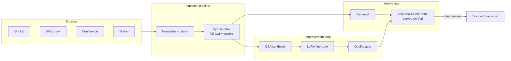

## What Vchat is

Vchat is a knowledge assistant built by Veri that answers your team's questions from your own documentation, with citations. You connect knowledge sources (a GitHub repository, a web crawl, Confluence, or Notion), add the bot to Discord, and @mention it wherever your team works. Every answer links back to the source documents it came from.

Vchat can also be a self-improving system: you can enable fine-tuning, and the model behind your assistant is then periodically trained on your documentation using the Veri training platform, so answer quality tracks your docs as they change.

This page explains how the system works end to end so you know exactly what happens to your data and where answers come from.

## Architecture at a glance

## Ingestion: from your docs to a searchable corpus

When you connect a source, Vchat fetches its documents, normalizes them, and splits them into chunks. Each chunk is indexed two ways:

- **Full-text search** for exact terms, identifiers, and code symbols.
- **Vector embeddings** for semantic similarity, so a question phrased differently from the docs still finds the right passage.

Sources are re-synced on a schedule. Only the connected sources are ever ingested. Messages in your Discord or Slack channels are never stored in the corpus; chat platforms are an interface, not a data source.

## Answering a question

When someone @mentions the bot:

1. The question runs through hybrid retrieval (full-text plus vector search) over your corpus.
2. The retrieved passages and the question go to your assistant's model, which is instructed to answer only from the provided material.
3. The reply includes numbered citations pointing at the exact source documents used.

If the corpus has no relevant material, the assistant says so rather than guessing.

Every question and answer is recorded as a trace you can inspect in the dashboard: what was asked, which passages were retrieved, and what the model answered. This is your window into how the assistant is behaving in your Discord server.

## The self-improving part (optional)

Fine-tuning is off by default: out of the box, Vchat answers with retrieval over your corpus. When you enable fine-tuning, your tenant gets its own model adapter, trained from a shared tool-calling base model. Fine-tuning runs as LoRA training jobs on the Veri platform and consumes credits from your workspace balance:

1. **Change detection.** When your documentation changes, the pipeline diffs the corpus against the last training snapshot.
2. **Training data synthesis.** Question-and-answer pairs are generated from the changed material, grounded in the retrieved passages that support them. Feedback from the web chat (thumbs up or down, corrections) can also feed a preference-tuning pass, and that data goes through a stricter review step.
3. **LoRA fine-tune.** A training job produces a new adapter version for your tenant.
4. **Quality gate.** Before the new version serves any traffic, it must pass an evaluation suite: tool-call correctness, citation grounding, and answer-quality checks against a held-back set. If it does not beat the currently serving version, it is not promoted.
5. **Instant switchover.** Promotion is an adapter flip on the serving fleet: the new version starts serving immediately, and a regression triggers automatic rollback to the previous version.

You choose the retraining cadence, or trigger retrains on demand from the dashboard. More frequent retraining consumes more credits.

## Serving and availability

Your assistant is served on an always-warm, autoscaling GPU fleet, so there are no cold starts: the first question of the day answers as fast as the hundredth, and chats are not capped. On the dedicated tier, your assistant runs on its own deployment and you choose the model it is built on. If your workspace runs out of credits, the assistant keeps working on the shared base model with retrieval and citations intact; your fine-tuned adapter resumes serving the moment credits are added. Nothing shuts off.

## Data isolation and retention

- Each tenant's corpus lives in its own database, its own vector namespace, and its own document store. Tenant data is never mixed.
- Chat platform messages are never ingested; only connected sources are.
- Corpus and trace retention defaults to 90 days and is configurable.
- Training happens through the Veri platform's standard APIs, under the same isolation guarantees as any Veri training job.

## Billing

Vchat is a flat monthly subscription with two tiers:

- **Standard** gives you the assistant with unlimited chats on the shared serving fleet.
- **Dedicated** adds your choice of underlying model and a deployment reserved for your workspace.

On either tier, fine-tuning is an optional feature metered in credits: you pay for the GPU work of the training runs you choose to run. You can watch consumption in the dashboard, and auto-reload keeps the assistant training if you want it to always track your latest docs.
